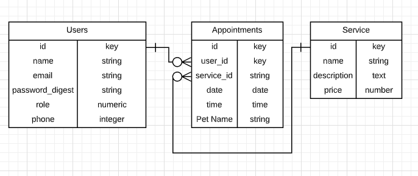

# Pets-Care-BackEnd-Api

- This is an API Back End Application.
- This Back End has a Users, Appointments and Services Tables.
- The Users table contains a Role Column to check the type of user.
- To create an Admin or Employe users a token is required.
- Only Admin users can create services and define the work hours.
- Each user can create new appointments and delete them.
- All the users can create future appointments +24 hours
- The Admin and Employe user can check all the appoints of the day.
- The Users has a proper authenticated login using sessions to restriccs access and functions.
- If Service or User is destroyed all the related appointments are destroyed.


# ERD


# Used Tools
- Ruby 2.6.3
- Rails 5.2.4
- FireBase Storage

## How to use it

This is the back end server. You can use this app [online using the front end](https://pets-care.netlify.app).

Or you can get a local copy up and running follow these simple steps.

Download the project with
```
$ git clone https://github.com/Salvador-ON/Pets-Care-BackEnd-Api.git
```
Also you can download the project from this [link](https://github.com/Salvador-ON/Pets-Care-BackEnd-Api).


Before running the app you also need to download the [Front End application](https://github.com/Salvador-ON/Pets-Care-FrontEnd).

Also you need to set up some settinngs

First you need to create the file ```/config/apllication.yml``` and set up your tokens.

```
ADMIN_TOKEN: "PersonalizedToken"
EMPLOYE_TOKEN: "PersonalizedToken"
```

To start the server. You need to have installed Ruby 2.6.3 and Rails 5..2.4 

Then go inside the project's folder at the terminal an run 

```
rails s -p 3001
```

## Test-driven development RSPEC

The code includes unit testing using RSpec. To start the test run the next line in your terminal:

```
bundle exec rspec
```

## Author

**Salvador Olvera**
- Linkedin: [Salvador Olvera](https://www.linkedin.com/in/salvador-olvera-n)
- Github: [@Salvador-ON](https://github.com/Salvador-ON)
- Twitter: [@Salvador Olvera_ON](https://twitter.com/Salvador_ON) 


## Show your support

Give a ⭐️ if you like this project!


